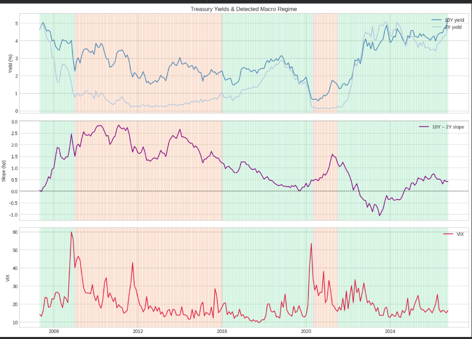

# Macro Regime Engine

[](https://colab.research.google.com/github/DawoodZak/macro-regime-engine/blob/main/Macro_Regime_Engine.ipynb)

**Systematic macro research project** — classifies U.S. Expansion vs Stress regimes using Hidden Markov Models on FRED data, analyzes cross-asset performance, and backtests a regime-conditional strategy out-of-sample.

> **For recruiters:** Click **Open in Colab → Run all**. No API key or signup required. Results are also summarized below — you don't need to run anything.

**Target role:** Macro PM / Global Macro / Multi-Asset

---

## Results at a glance

| Strategy (OOS 2016–2025) | Ann. Return | Sharpe | Max Drawdown |
|--------------------------|-------------|--------|--------------|
| Regime Strategy | 8.99% | 0.76 | -23.8% |
| 60/40 SPY-TLT | 9.29% | 0.82 | -28.2% |
| Equal Weight | 8.24% | 1.28 | -12.6% |

**Regime findings:**
- **Expansion (~77%):** GLD +10.9%, SPY +9.1% (annualized)
- **Stress (~23%):** UUP -5.7%, TLT -2.9%; GLD still positive

**Stack:** Python · pandas · hmmlearn · FRED · Yahoo Finance



---

## What it does

1. Pulls macro data from **FRED** (yields, CPI, unemployment, Fed Funds, VIX)
2. Pulls cross-asset ETFs from **Yahoo Finance** (SPY, TLT, GLD, UUP)
3. Fits a **Gaussian HMM** on macro features (trained through 2015)
4. Labels **Expansion vs Stress** regimes
5. Backtests regime-conditional allocation vs benchmarks (no look-ahead)

---

## Run it (one click)

1. Click **Open in Colab** above
2. **Runtime → Run all**
3. Done — no API key needed

*Optional:* Add a free `FRED_API_KEY` in Colab Secrets for slightly faster data pulls. Not required.

---

## Local setup

```bash
pip install -r requirements.txt
jupyter notebook Macro_Regime_Engine.ipynb
```

---

## Project structure

```
macro-regime-engine/
├── Macro_Regime_Engine.ipynb
├── docs/regime_timeline.png
├── requirements.txt
└── README.md
```

---

## Resume bullets

- Built a macro regime engine (HMM + FRED) classifying U.S. Expansion vs Stress; analyzed cross-asset behavior across 224 monthly observations (GLD +11% ann. in Stress, UUP -5.7%).
- Backtested regime-conditional allocation OOS (Sharpe 0.76, max DD -23.8%) vs 60/40 benchmark (Sharpe 0.82, max DD -28.2%) with no look-ahead bias.

---

## Author

**Dawood Zakarnah** — [github.com/DawoodZak](https://github.com/DawoodZak)

*Educational project only — not investment advice.*
